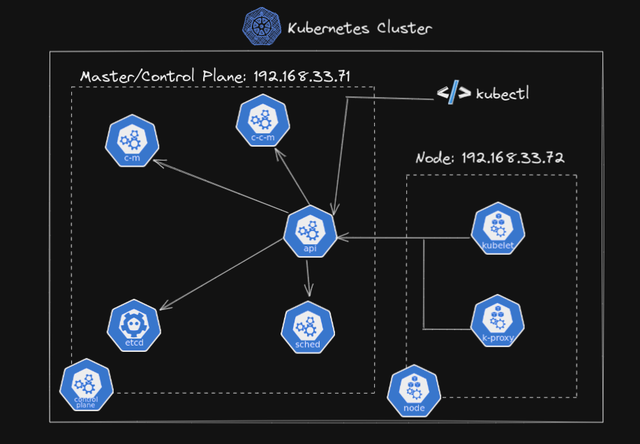
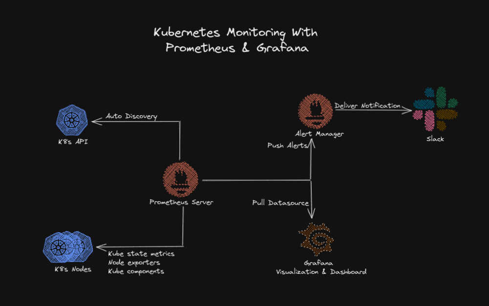
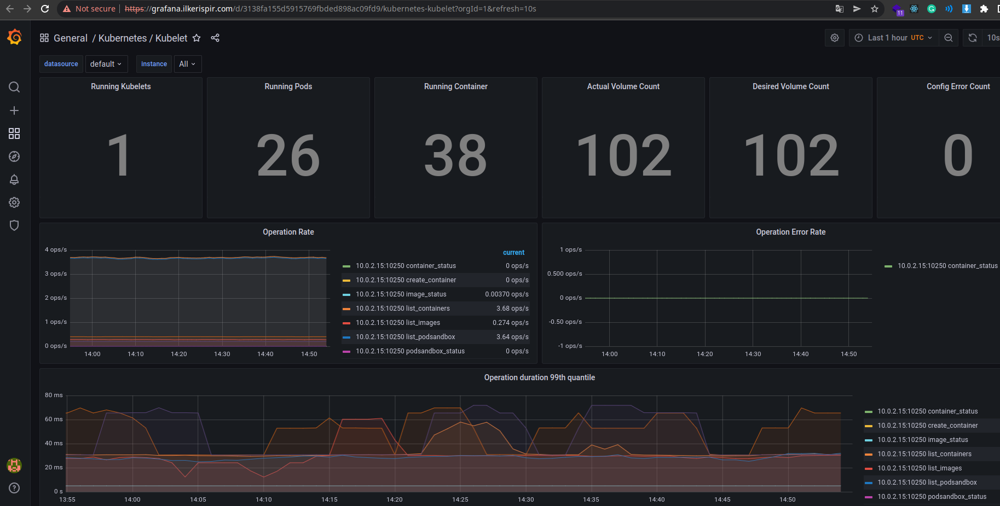
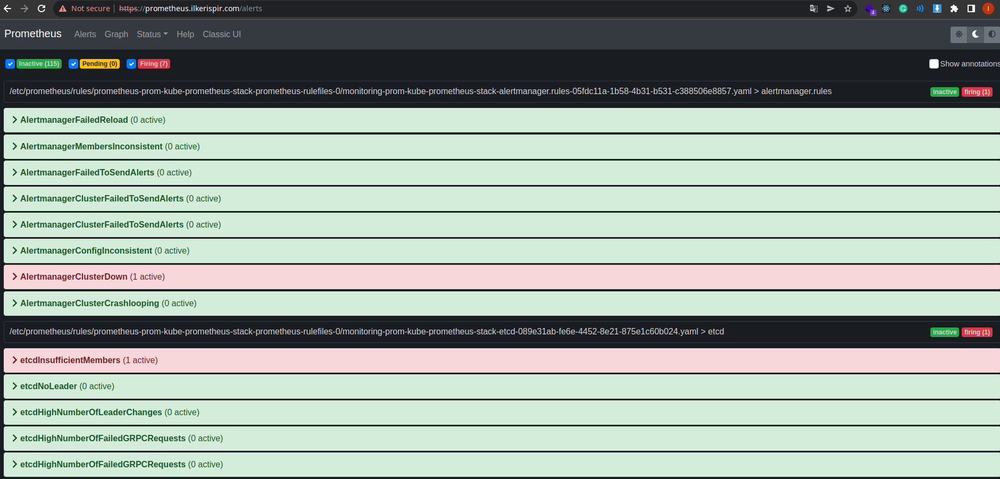
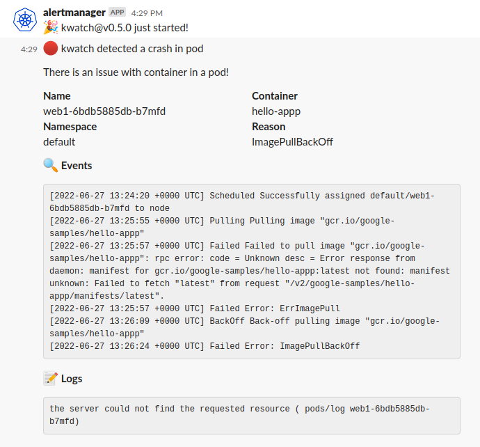
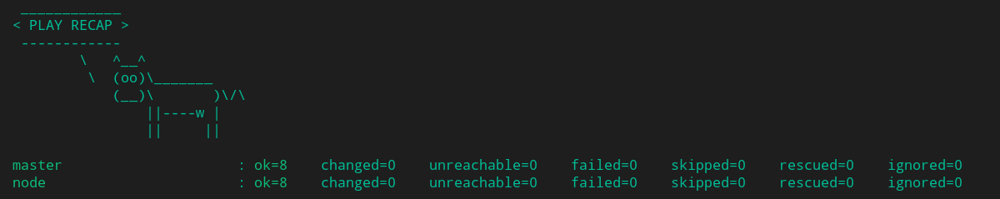
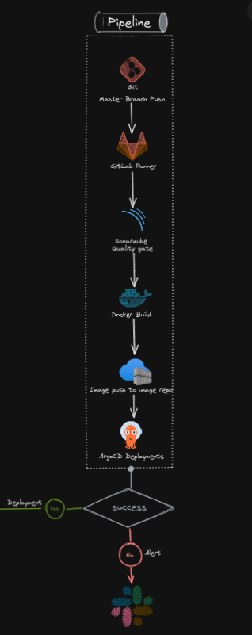
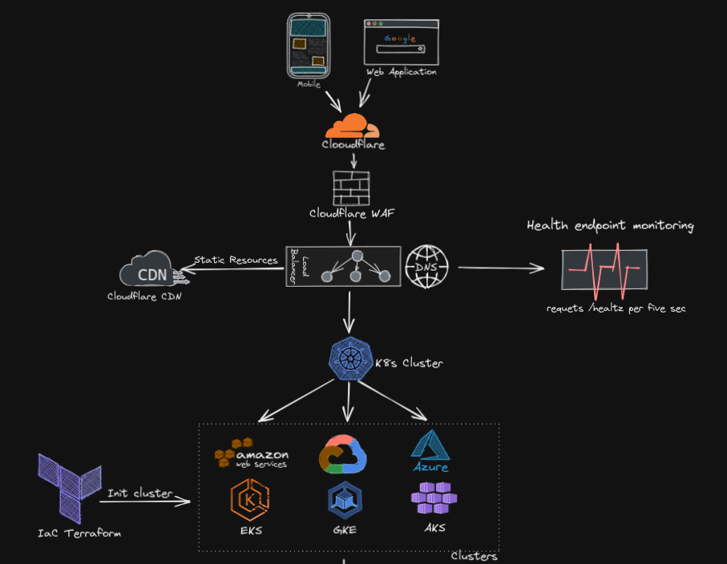

# DevOps Case Study

## Requirements

* [Vagrant](https://www.vagrantup.com/downloads)
  * [Vagrant Host Manager Plugin](https://github.com/devopsgroup-io/vagrant-hostmanager)
* [Ansible](https://docs.ansible.com/ansible/latest/installation_guide/intro_installation.html)
* [Virtualbox(If your processor is x86-64 or AMD based.)](https://www.virtualbox.org/wiki/Downloads)
* [Parallels(If your processor is ARM based. For example, if you have a computer with the Apple M1 series)](https://www.parallels.com/eu/products/desktop/trial/)

## Init cluster
```bash
vagrant up
```

## Shutdown cluster
```bash
vagrant halt
```

## Destroy cluster
```bash
vagrant destroy -f
```
## Get KUBECONFIG
```bash
vagrant ssh master -c "sudo cat ~/.kube/config" > ~/.kube/hb-devops-case
```

## Export KUBECONFIG
```bash
export KUBECONFIG=~/.kube/hb-devops-case
```

### Cert Exp Service Endpoint
```bash
curl https://k8s-cert-exp.ilkerispir.com/
```

### Grafana
```bash
curl https://grafana.ilkerispir.com/
```

### Prometheus
```bash
curl https://prometheus.ilkerispir.com/
```

### Argo CD
```bash
curl https://argo-cd.ilkerispir.com/
```

## ToDo List
- [x] Flowchart(Excalidraw)
- [x] K8s cluster
- [x] Monitoring system (Prometheus & Grafana)
- [x] Alert thresholds(min 3 alert)
- [x] Redeploy & reconfig(Iac(Ansible) example)
- [ ] Certs & expiration dates service
- [ ] CI/CD

## Architectures

### K8s Arch


### Monitoring, Alert, Time Series Database Tools
* [Grafana](https://grafana.com/docs/)
* [Prometheus](https://prometheus.io/docs/introduction/overview/)
* [Alertmanager](https://prometheus.io/docs/alerting/latest/alertmanager/)
* [Kwatch](https://github.com/abahmed/kwatch/)

### Top alert definitions for 3 metrics
* CPU, RAM usage more than 80%
* Pod, Node crashes for various reasons
* Out of free space on the disk

### Monitoring & Alert Arch


### Prometheus Example Alerts


### Grafana Example Dashboard


### Kwatch Example Alert Message


### IaC Example with Ansbile
* Let's have a sample batch configuration change settings scenario on machines. Let's have 2 machines as in this K8s cluster (of course there may be more).
* We can group these machines according to our wishes. For example, we can specify group names as all, master and node.

```
[all]
master                 ansible_host=192.168.33.71
node                   ansible_host=192.168.33.72

[master]
master

[node]
node
```

* Then we can do different operations according to the roles in our Ansible playbook.

```yaml
- hosts: all
  become: yes
  roles:
    - common

- hosts: master
  become: yes
  roles:
    - common

- hosts: node
  become: yes
  roles:
    - common
```

* We can perform batch operations on the machine blog with the Ansible command I wrote in the example below
```bash
PYTHONUNBUFFERED=1 ANSIBLE_FORCE_COLOR=true ANSIBLE_HOST_KEY_CHECKING=false ANSIBLE_SSH_ARGS='-o UserKnownHostsFile=/dev/null -o IdentitiesOnly=yes -o ControlMaster=auto -o ControlPersist=60s' ansible-playbook --connection=ssh --timeout=30 --user="vagrant" --limit="all" --inventory-file=./hosts --ask-pass --become -vvv ansible.yml
```

* Ansible result


### K8s Cert Exp Service

### CI/CD



### Better solutions

* Best Practice Infrastructure Arch 

